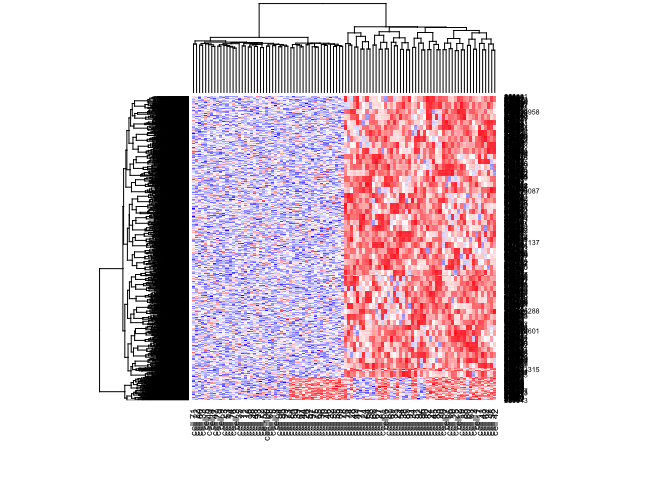
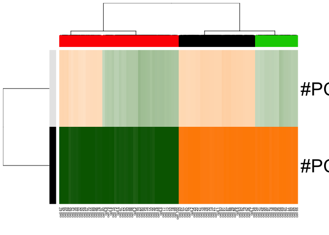

# Experimental use of PAGODA

In this vignette, we show you how to modify `pagoda` to run on your own normalized gene expression and associated weights matrices. 

**NOTE:** Gene expression matrices must be normalized. Variances observed in the normalized data must be representative of biological variation. We strongly recommend taking into consideration magnitude dependencies, batch effects, library size, and other potential technical aspects of variability. 

**IMPORTANT:** Depending on your normalization and weights, results may be misleading and/or non-sensical. This vignette is experimental. USE WITH CAUTION. 


## Simulating data for demonstration purposes

For the purposes of demonstration, we will simulate a normalized gene expression matrix. We will generate out data such that there are two major components of variation, supported by every other pathway. 

```r
# Get gene sets
library(org.Hs.eg.db)
gos <- ls(org.Hs.egGO2ALLEGS)
gos.sub <- mget(gos[1:10], org.Hs.egGO2ALLEGS)
go.env <- list2env(gos.sub)
# Get genes from this universe
genes <- unlist(gos.sub)
N <- length(unique(genes))
# Simulate cells
M <- 100
cells <- paste('cell', 1:M)
# Simulate normalized gene expression matrix
mat <- do.call(rbind, lapply(seq_along(gos.sub), function(i) {
  gs <- gos.sub[[i]]
  set.seed(i%%2) # make every other pathway split the same cells
  c <- sample(1:M, M/2, replace=FALSE) 
  s <- length(gs)
  mat <- matrix(rnorm(s*M,mean=0,sd=5), s, M)
  mat[, c] <- rnorm(s*c,mean=10,sd=5)
  rownames(mat) <- gs
  colnames(mat) <- cells
  return(mat)
}))
# Get rid of duplicate generated gene
mat <- mat[unique(genes),]
# Just cluster and visualize gene expression
heatmap(mat, col = colorRampPalette(c('blue', 'white', 'red'))(100))
```

 

We will set the associated weights to 1 for all observations in all cells and calculated variances for each gene. 


```r
# Set all weights to 1
matw <- matrix(1, N, M)
rownames(matw) <- rownames(mat)
colnames(matw) <- colnames(mat)
# Regular variance since equal weights anyway
var <- apply(mat, 1, var)
```

## Using `pagoda` with custom matrices

Now we can put our simulated data into an object to pipe into the `pagoda` pipeline.


```r
# Create varinfo object to pipe into PAGODA
varinfo <- list('mat' = mat, 'matw' = matw, 'arv' = var)
```

When we run `pagoda` on the generated data, we indeed recover our two major components of variation. 


```r
# Run PAGODA with generated data
pwpca <- pagoda.pathway.wPCA(varinfo, go.env, n.components = 1, batch.center = FALSE, verbose = 1)
tam <- pagoda.top.aspects(pwpca, n.cells = NULL, z.score = qnorm(0.01/2, lower.tail = FALSE))
tamr <- pagoda.reduce.loading.redundancy(tam, pwpca)
tamr2 <- pagoda.reduce.redundancy(tamr, distance.threshold = 0.2)

# Cluster on final
hc <- hclust(dist(t(tamr2$xv)), method='ward.D')
col.cols <- rbind(groups = cutree(hc, 3))
pagoda.view.aspects(tamr2, cell.clustering = hc, col.cols = col.cols)
```

 

We can also create an interactive app to browse our results. 


```r
app <- make.pagoda.app(tamr2, tam, varinfo, go.env, pwpca, col.cols = col.cols, cell.clustering = hc, title = "Experiment")
show.app(app, "Experiment", browse = TRUE, port = 1400)  
```
